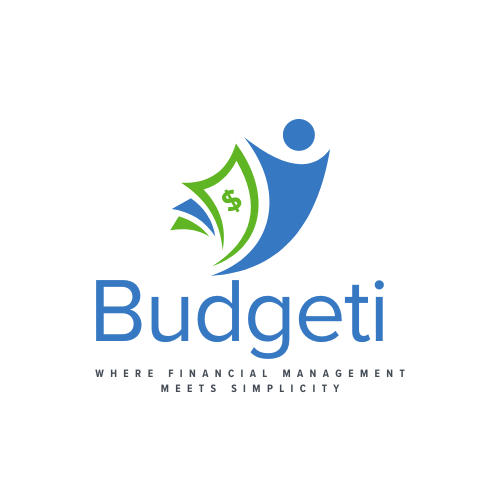

<a name="readme-top"></a>

<a name="readme-top"></a>

<div align="center">

  
  <br/>

  <h1><b>💰 Budgeti</b></h1>

  <p>Your personal budget management app!</p>

</div>

# 📗 Table of Contents

- [📖 About Budgeti](#about-budgeti)
  - [🛠 Built With](#built-with)
    - [Tech Stack](#tech-stack)
    - [Key Features](#key-features)
  - [💻 Getting Started](#getting-started)
    - [Setup](#setup)
    - [Prerequisites](#prerequisites)
    - [Install](#install)
    - [Usage](#usage)
    - [Run Project](#run-project)
    - [Run Tests](#run-tests)
  - [👥 Contributors](#contributors)
  - [🔍 What's Next?](#whats-next)
  - [🤝 Let's Collaborate](#lets-collaborate)
  - [⭐️ Star It](#star-it)
  - [🙏 Acknowledgments](#acknowledgements)
  - [❓ FAQ](#faq)
  - [📝 License](#license)

<!-- ABOUT BUDGETI -->

## 📖 About Budgeti <a name="about-budgeti"></a>

Welcome to Budgeti, your go-to app for managing personal finances. Take control of your budget, track expenses, and plan for financial success.

## 🛠 Built With <a name="built-with"></a>

### Tech Stack <a name="tech-stack"></a>

<details>
  <summary>Backend</summary>
  <ul>
    <li><a href="https://rubyonrails.org/">Ruby on Rails</a></li>
  </ul>
</details>

<details>
  <summary>Frontend</summary>
  <ul>
    <li><a href="https://getbootstrap.com/">Bootstrap</a></li>
  </ul>
</details>

<details>
  <summary>Database</summary>
  <ul>
    <li><a href="https://www.postgresql.org/">PostgreSQL</a></li>
  </ul>
</details>

### Key Features <a name="key-features"></a>

- **User Authentication:** Securely log in and register with Devise.
- **Expense Tracking:** Record and manage your expenses effortlessly.
- **Category Management:** Categorize your expenses for better insights.

<p align="right">(<a href="#readme-top">back to top</a>)</p>

<!-- GETTING STARTED -->

## 💻 Getting Started <a name="getting-started"></a>

> The following steps will guide you in setting up and running Budgeti:

### Setup

Clone this repository to your desired folder:

```sh
git clone https://github.com/AlierPM/Budgeti.git

```

### Prerequisites

In order to run this project, you need:

1. Ruby installed:
   - On macOS using Homebrew:

     ```sh
     brew install ruby
     ```

   - On Windows or Linux, follow the installation instructions from [Ruby's official website](https://www.ruby-lang.org/en/documentation/installation/).

2. Rails Installed:

   ```sh
   gem install rails
   ```

### Setup

Clone this repository to your desired folder:
```sh
  git clone https://github.com/AlierPM/Budgeti.git
```

### Install

Navigate to the Budgeti directory:

```sh
  cd Budgeti
```

### Usage

Open the project in your preferred code editor:
```sh
   cd Budgeti
   code .
```

### Run project

To run from the local server, execute the following command:

```sh
  rails server
```
### Run tests

To run tests, execute the following command:

```sh
  rpec spec
```

<p align="right">(<a href="#readme-top">back to top</a>)</p>

<!-- CONTRIBUTORS -->
👥 Contributors <a name="contributors"></a>
Meet the masterminds behind Budgeti.

👩‍💻 Finance Guru

👤 **Alier Philip Maguet**

- GitHub: [@AlierPM](https://github.com/AlierPM)
- Twitter: [@AlierPM](https://twitter.com/AlierPM)
- LinkedIn: [@AlierPM](https://www.linkedin.com/in/alierphilipmaguet/)

<p align="right">(<a href="#readme-top">back to top</a>)</p>

<!-- WHAT'S NEXT? -->
🔍 What's Next? <a name="whats-next"></a>
## 🔮 What's Cooking Next? <a name="whats-cooking-next"></a>
Budgeti is always evolving. Here's a taste of what's cooking next:

- [ ] **Expense Categories**
- [ ] **Monthly Reports**
- [ ] **Integration with Financial APIs**

<!-- LET'S COLLABORATE -->

## 🤝 Let's Collaborate <a name="lets-collaborate"></a>

Join the recipe revolution! Contribute to Recipedaily by:

- Reporting Bugs
- Adding Features
- Enhancing Documentation

Feel free to check the [issues page](../../issues/) for ongoing discussions.

<p align="right">(<a href="#readme-top">back to top</a>)</p>

<!-- STAR IT -->
## ⭐️ Star It <a name="star-it"></a>
> If you find Budgeti helpful, show your support by starring the repository. It adds a dash of motivation to our financial journey!

<p align="right">(<a href="#readme-top">back to top</a>)</p>

<!-- ACKNOWLEDGEMENTS -->
🙏 Acknowledgments <a name="acknowledgements"></a>

> A big thank you to everyone who contributed to the development of Budgeti.

- Special thanks to Microverse for providing an exceptional collaborative learning environment and making this project possible.

- Original design idea by [Gregoire Vella on Behance](https://www.behance.net/gallery/19759151/Snapscan-iOs-design-and-branding).


<p align="right">(<a href="#readme-top">back to top</a>)</p>

<!-- FAQ -->
## ❓ FAQ <a name="faq"></a>

- **Q: How do I track my expenses?**

  - A: Log in, head to your dashboard, and click on the "Track Expenses" button.

- **Q: Can I set a monthly budget?**

  - A: Absolutely! Visit the "Budgets" section to set and manage your financial goals.

<p align="right">(<a href="#readme-top">back to top</a>)</p>


<!-- LICENSE -->

## 📝 License <a name="license"></a>

This project is [MIT](./License) licensed. We invite you to cook up your own creative ideas using our recipe.

<p align="right">(<a href="#readme-top">back to top</a>)</p>
